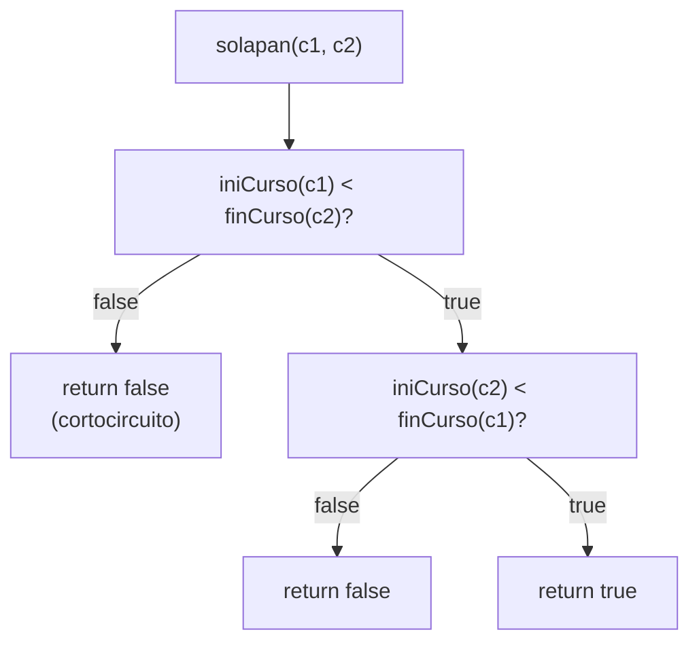
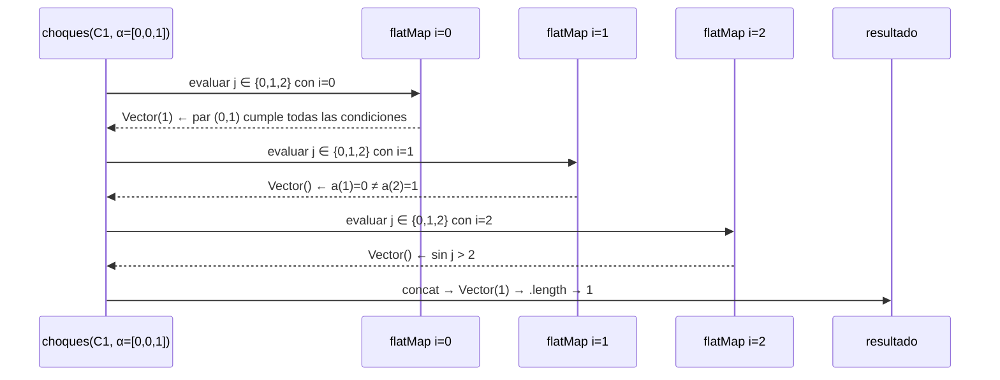
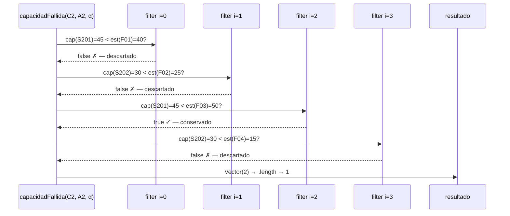
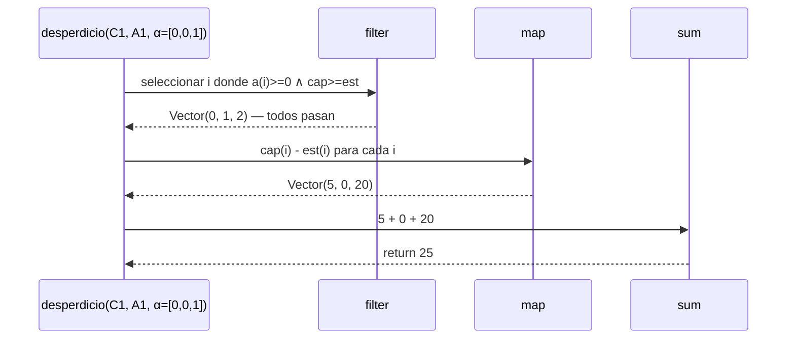

# Informe de Proceso — Proyecto Final

**Fundamentos de Programación Funcional y Concurrente**  
**Tema:** Asignación Óptima de Aulas

---

## Integrante 1 — `solapan`, `choques`, `capacidadFallida`, `desperdicio`

---

### `solapan`

**Implementación:**

```scala
def solapan(c1: Curso, c2: Curso): Boolean = {
  iniCurso(c1) < finCurso(c2) && iniCurso(c2) < finCurso(c1)
}
```

**Enfoque (expresión booleana directa):**

`solapan` no es recursiva ni usa funciones de alto orden — evalúa directamente la
condición matemática de intersección de intervalos semiabiertos:

$$
\text{solapan}(c_1, c_2) \iff \text{ini}_{c_1} < \text{fin}_{c_2} \;\land\; \text{ini}_{c_2} < \text{fin}_{c_1}
$$

El operador `&&` aplica cortocircuito: si la primera condición es `false`, la segunda
no se evalúa.

---

### Traza de `solapan` — caso con solapamiento

**Entrada:** $c_1 = \langle\text{M01}, 4, 8, 25\rangle$, $c_2 = \langle\text{M02}, 6, 10, 30\rangle$

| Paso | Expresión | Valor |
|------|-----------|-------|
| 1 | `iniCurso(M01) < finCurso(M02)` → `4 < 10` | `true` |
| 2 | `iniCurso(M02) < finCurso(M01)` → `6 < 8`  | `true` |
| 3 | `true && true` | `true` |

**Resultado:** `true` ✓

---

### Traza de `solapan` — caso sin solapamiento

**Entrada:** $c_1 = \langle\text{M01}, 4, 8, 25\rangle$, $c_3 = \langle\text{M03}, 12, 16, 20\rangle$

| Paso | Expresión | Valor |
|------|-----------|-------|
| 1 | `iniCurso(M01) < finCurso(M03)` → `4 < 16` | `true` |
| 2 | `iniCurso(M03) < finCurso(M01)` → `12 < 8` | `false` |
| 3 | `true && false` (cortocircuito) | `false` |

**Resultado:** `false` ✓

---

### Diagrama de evaluación de `solapan`



---

### `choques`

**Implementación:**

```scala
def choques(cursos: Cursos, a: Asignacion): Int = {
  val indices = cursos.indices.toVector
  indices.flatMap { i =>
    indices.filter { j =>
      j > i && a(i) == a(j) && a(i) >= 0 && solapan(cursos(i), cursos(j))
    }
  }.length
}
```

**Equivalente conceptual con `flatMap` y `filter` (dos generadores con guarda):**

```scala
indices.flatMap(i =>
  indices
    .filter(j => j > i && a(i) == a(j) && a(i) >= 0 && solapan(cursos(i), cursos(j)))
)
.length
```

**Regla aplicada:**

> Para cada $i$, `flatMap` produce la sublista de $j$ que cumplen la condición.
> La concatenación de todas las sublistas da exactamente los pares $(i,j)$ con $i < j$
> que comparten aula y se solapan. `.length` los cuenta.

$$
\text{CH}^\alpha_C = \bigl|\{(i,j) \mid 0 \le i < j < n,\; \alpha_i = \alpha_j,\; \alpha_i \ge 0,\; c_i \text{ solapa con } c_j\}\bigr|
$$

---

### Traza de `choques`

**Entrada:** $C_1 = \langle\langle\text{M01},4,8,25\rangle,\langle\text{M02},6,10,30\rangle,\langle\text{M03},12,16,20\rangle\rangle$, $\alpha = \langle 0,0,1 \rangle$

| Paso | $i$ | $j$ | `j > i` | `a(i)==a(j)` | `a(i)>=0` | `solapan` | Cuenta |
|------|-----|-----|---------|-------------|----------|-----------|--------|
| 1 | 0 | 1 | ✓ | `0==0` ✓ | ✓ | M01∩M02 ✓ | **sí** |
| 2 | 0 | 2 | ✓ | `0==1` ✗ | — | — | no |
| 3 | 1 | 2 | ✓ | `0==1` ✗ | — | — | no |

**Resultado:** `Vector(1).length` → **1** ✓

---

### Diagrama de llamados de `choques`



---

### `capacidadFallida`

**Implementación:**

```scala
def capacidadFallida(cursos: Cursos, aulas: Aulas, a: Asignacion): Int = {
  cursos.indices.toVector.filter { i =>
    a(i) >= 0 && capAula(aulas(a(i))) < estCurso(cursos(i))
  }.length
}
```

**Equivalente con `filter`:**

```scala
cursos.indices.toVector
  .filter(i => a(i) >= 0 && capAula(aulas(a(i))) < estCurso(cursos(i)))
  .length
```

**Regla aplicada:**

> `filter` retiene los índices $i$ donde el curso está asignado y su aula tiene
> capacidad insuficiente. `.length` cuenta los fallos.

$$
\text{CF}^\alpha_{C,A} = \bigl|\{i \mid \alpha_i \ge 0 \;\land\; \text{cap}_{A_{\alpha_i}} < \text{est}_{c_i}\}\bigr|
$$

---

### Traza de `capacidadFallida`

**Entrada (Ejemplo 2 del enunciado):**  
$A_2 = \langle\langle\text{S201},45\rangle,\langle\text{S202},30\rangle\rangle$, $\alpha = \langle 0,1,0,1 \rangle$

| Paso | $i$ | Curso | Aula | cap | est | `cap < est` | Acción |
|------|-----|-------|------|-----|-----|------------|--------|
| 1 | 0 | F01 | S201 | 45 | 40 | `false` | descarta |
| 2 | 1 | F02 | S202 | 30 | 25 | `false` | descarta |
| 3 | 2 | F03 | S201 | 45 | 50 | `true`  | **conserva** |
| 4 | 3 | F04 | S202 | 30 | 15 | `false` | descarta |

**Resultado:** `Vector(2).length` → **1** ✓

---

### Diagrama de llamados de `capacidadFallida`



---

### `desperdicio`

**Implementación:**

```scala
def desperdicio(cursos: Cursos, aulas: Aulas, a: Asignacion): Int = {
  cursos.indices.toVector.filter { i =>
    a(i) >= 0 && capAula(aulas(a(i))) >= estCurso(cursos(i))
  }.map { i =>
    capAula(aulas(a(i))) - estCurso(cursos(i))
  }.sum
}
```

**Equivalente con `filter` → `map` → `sum`:**

```scala
cursos.indices.toVector
  .filter(i => a(i) >= 0 && capAula(aulas(a(i))) >= estCurso(cursos(i)))
  .map(i => capAula(aulas(a(i))) - estCurso(cursos(i)))
  .sum
```

**Regla aplicada:**

> `filter` selecciona los cursos con capacidad suficiente (diferencia $\ge 0$).
> `map` transforma cada índice en su desperdicio individual.
> `sum` acumula el total.
> El $\max(\cdot,0)$ de la especificación queda implícito: `filter` excluye
> los casos donde la diferencia sería negativa.

$$
\text{DE}^\alpha_{C,A} = \sum_{\substack{i=0\\\alpha_i \ge 0}}^{n-1} \max\!\bigl(\text{cap}_{A_{\alpha_i}} - \text{est}_{c_i},\; 0\bigr)
$$

---

### Traza de `desperdicio`

**Entrada:** $A_1 = \langle\langle\text{E101},30\rangle,\langle\text{E102},40\rangle\rangle$, $\alpha = \langle 0,0,1 \rangle$

**Paso 1 — `filter` (cap ≥ est):**

| $i$ | Curso | cap | est | `cap >= est` | Acción |
|-----|-------|-----|-----|-------------|--------|
| 0 | M01 | 30 | 25 | `true`  | conserva |
| 1 | M02 | 30 | 30 | `true`  | conserva |
| 2 | M03 | 40 | 20 | `true`  | conserva |

**Paso 2 — `map` (cap − est):**

| $i$ | cap − est | Valor |
|-----|-----------|-------|
| 0 | 30 − 25 | 5 |
| 1 | 30 − 30 | 0 |
| 2 | 40 − 20 | 20 |

**Paso 3 — `sum`:**

$$5 + 0 + 20 = \mathbf{25}$$

**Resultado:** **25** ✓

---

### Diagrama de llamados de `desperdicio`


