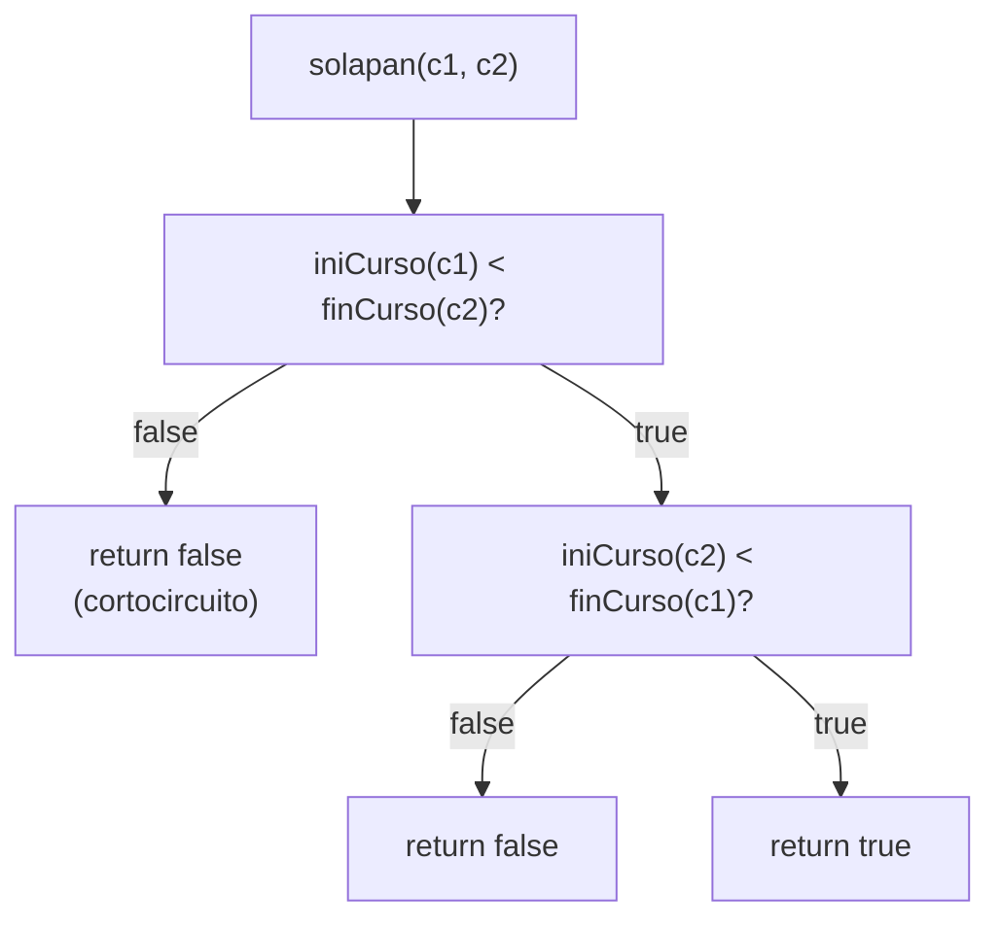
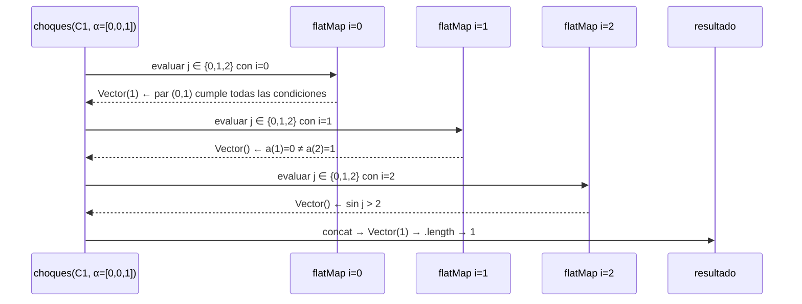
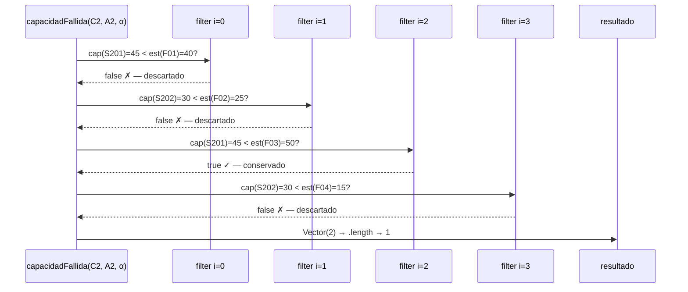
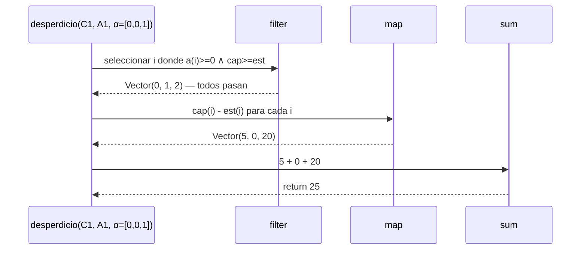
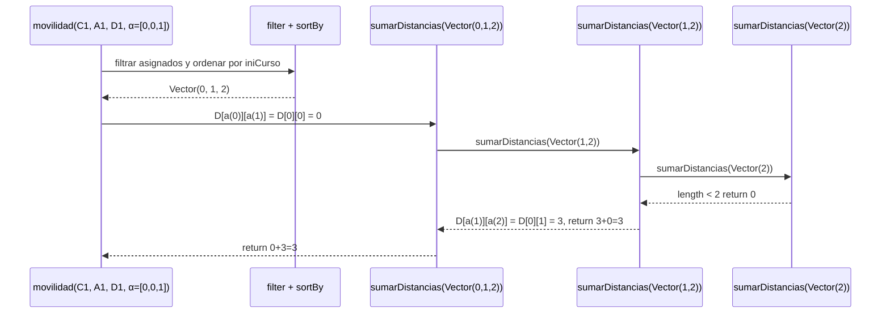
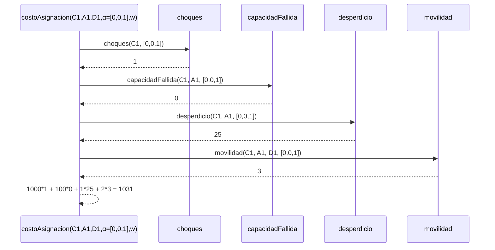
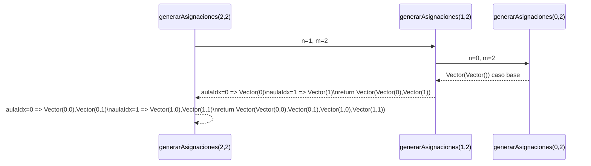
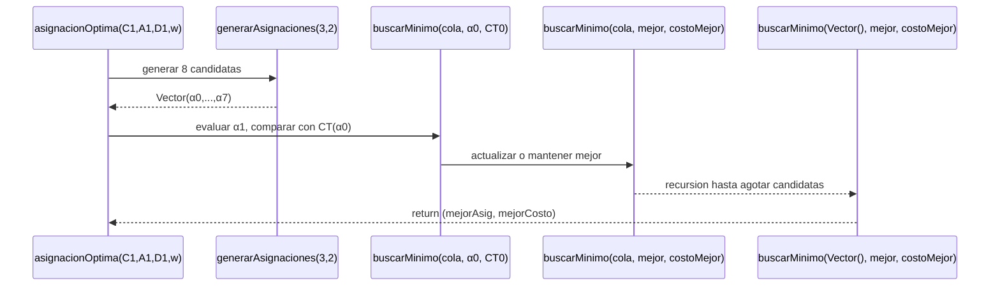

# Informe de Proceso — Proyecto Final

**Fundamentos de Programación Funcional y Concurrente**  
**Tema:** Asignación Óptima de Aulas

---

## Integrante 1 — `solapan`, `choques`, `capacidadFallida`, `desperdicio`

---

### `solapan`

**Implementación:**

```scala
def solapan(c1: Curso, c2: Curso): Boolean = {
  iniCurso(c1) < finCurso(c2) && iniCurso(c2) < finCurso(c1)
}
```

**Enfoque (expresión booleana directa):**

`solapan` no es recursiva ni usa funciones de alto orden — evalúa directamente la
condición matemática de intersección de intervalos semiabiertos:

$$
\text{solapan}(c_1, c_2) \iff \text{ini}_{c_1} < \text{fin}_{c_2} \;\land\; \text{ini}_{c_2} < \text{fin}_{c_1}
$$

El operador `&&` aplica cortocircuito: si la primera condición es `false`, la segunda
no se evalúa.

---

### Traza de `solapan` — caso con solapamiento

**Entrada:** $c_1 = \langle\text{M01}, 4, 8, 25\rangle$, $c_2 = \langle\text{M02}, 6, 10, 30\rangle$

| Paso | Expresión | Valor |
|------|-----------|-------|
| 1 | `iniCurso(M01) < finCurso(M02)` → `4 < 10` | `true` |
| 2 | `iniCurso(M02) < finCurso(M01)` → `6 < 8`  | `true` |
| 3 | `true && true` | `true` |

**Resultado:** `true` ✓

---

### Traza de `solapan` — caso sin solapamiento

**Entrada:** $c_1 = \langle\text{M01}, 4, 8, 25\rangle$, $c_3 = \langle\text{M03}, 12, 16, 20\rangle$

| Paso | Expresión | Valor |
|------|-----------|-------|
| 1 | `iniCurso(M01) < finCurso(M03)` → `4 < 16` | `true` |
| 2 | `iniCurso(M03) < finCurso(M01)` → `12 < 8` | `false` |
| 3 | `true && false` (cortocircuito) | `false` |

**Resultado:** `false` ✓

---

### Diagrama de evaluación de `solapan`



---

### `choques`

**Implementación:**

```scala
def choques(cursos: Cursos, a: Asignacion): Int = {
  val indices = cursos.indices.toVector
  indices.flatMap { i =>
    indices.filter { j =>
      j > i && a(i) == a(j) && a(i) >= 0 && solapan(cursos(i), cursos(j))
    }
  }.length
}
```

**Equivalente conceptual con `flatMap` y `filter` (dos generadores con guarda):**

```scala
indices.flatMap(i =>
  indices
    .filter(j => j > i && a(i) == a(j) && a(i) >= 0 && solapan(cursos(i), cursos(j)))
)
.length
```

**Regla aplicada:**

> Para cada $i$, `flatMap` produce la sublista de $j$ que cumplen la condición.
> La concatenación de todas las sublistas da exactamente los pares $(i,j)$ con $i < j$
> que comparten aula y se solapan. `.length` los cuenta.

$$
\text{CH}^\alpha_C = \bigl|\{(i,j) \mid 0 \le i < j < n,\; \alpha_i = \alpha_j,\; \alpha_i \ge 0,\; c_i \text{ solapa con } c_j\}\bigr|
$$

---

### Traza de `choques`

**Entrada:** $C_1 = \langle\langle\text{M01},4,8,25\rangle,\langle\text{M02},6,10,30\rangle,\langle\text{M03},12,16,20\rangle\rangle$, $\alpha = \langle 0,0,1 \rangle$

| Paso | $i$ | $j$ | `j > i` | `a(i)==a(j)` | `a(i)>=0` | `solapan` | Cuenta |
|------|-----|-----|---------|-------------|----------|-----------|--------|
| 1 | 0 | 1 | ✓ | `0==0` ✓ | ✓ | M01∩M02 ✓ | **sí** |
| 2 | 0 | 2 | ✓ | `0==1` ✗ | — | — | no |
| 3 | 1 | 2 | ✓ | `0==1` ✗ | — | — | no |

**Resultado:** `Vector(1).length` → **1** ✓

---

### Diagrama de llamados de `choques`



---

### `capacidadFallida`

**Implementación:**

```scala
def capacidadFallida(cursos: Cursos, aulas: Aulas, a: Asignacion): Int = {
  cursos.indices.toVector.filter { i =>
    a(i) >= 0 && capAula(aulas(a(i))) < estCurso(cursos(i))
  }.length
}
```

**Equivalente con `filter`:**

```scala
cursos.indices.toVector
  .filter(i => a(i) >= 0 && capAula(aulas(a(i))) < estCurso(cursos(i)))
  .length
```

**Regla aplicada:**

> `filter` retiene los índices $i$ donde el curso está asignado y su aula tiene
> capacidad insuficiente. `.length` cuenta los fallos.

$$
\text{CF}^\alpha_{C,A} = \bigl|\{i \mid \alpha_i \ge 0 \;\land\; \text{cap}_{A_{\alpha_i}} < \text{est}_{c_i}\}\bigr|
$$

---

### Traza de `capacidadFallida`

**Entrada (Ejemplo 2 del enunciado):**  
$A_2 = \langle\langle\text{S201},45\rangle,\langle\text{S202},30\rangle\rangle$, $\alpha = \langle 0,1,0,1 \rangle$

| Paso | $i$ | Curso | Aula | cap | est | `cap < est` | Acción |
|------|-----|-------|------|-----|-----|------------|--------|
| 1 | 0 | F01 | S201 | 45 | 40 | `false` | descarta |
| 2 | 1 | F02 | S202 | 30 | 25 | `false` | descarta |
| 3 | 2 | F03 | S201 | 45 | 50 | `true`  | **conserva** |
| 4 | 3 | F04 | S202 | 30 | 15 | `false` | descarta |

**Resultado:** `Vector(2).length` → **1** ✓

---

### Diagrama de llamados de `capacidadFallida`



---

### `desperdicio`

**Implementación:**

```scala
def desperdicio(cursos: Cursos, aulas: Aulas, a: Asignacion): Int = {
  cursos.indices.toVector.filter { i =>
    a(i) >= 0 && capAula(aulas(a(i))) >= estCurso(cursos(i))
  }.map { i =>
    capAula(aulas(a(i))) - estCurso(cursos(i))
  }.sum
}
```

**Equivalente con `filter` → `map` → `sum`:**

```scala
cursos.indices.toVector
  .filter(i => a(i) >= 0 && capAula(aulas(a(i))) >= estCurso(cursos(i)))
  .map(i => capAula(aulas(a(i))) - estCurso(cursos(i)))
  .sum
```

**Regla aplicada:**

> `filter` selecciona los cursos con capacidad suficiente (diferencia $\ge 0$).
> `map` transforma cada índice en su desperdicio individual.
> `sum` acumula el total.
> El $\max(\cdot,0)$ de la especificación queda implícito: `filter` excluye
> los casos donde la diferencia sería negativa.

$$
\text{DE}^\alpha_{C,A} = \sum_{\substack{i=0\\\alpha_i \ge 0}}^{n-1} \max\!\bigl(\text{cap}_{A_{\alpha_i}} - \text{est}_{c_i},\; 0\bigr)
$$

---

### Traza de `desperdicio`

**Entrada:** $A_1 = \langle\langle\text{E101},30\rangle,\langle\text{E102},40\rangle\rangle$, $\alpha = \langle 0,0,1 \rangle$

**Paso 1 — `filter` (cap ≥ est):**

| $i$ | Curso | cap | est | `cap >= est` | Acción |
|-----|-------|-----|-----|-------------|--------|
| 0 | M01 | 30 | 25 | `true`  | conserva |
| 1 | M02 | 30 | 30 | `true`  | conserva |
| 2 | M03 | 40 | 20 | `true`  | conserva |

**Paso 2 — `map` (cap − est):**

| $i$ | cap − est | Valor |
|-----|-----------|-------|
| 0 | 30 − 25 | 5 |
| 1 | 30 − 30 | 0 |
| 2 | 40 − 20 | 20 |

**Paso 3 — `sum`:**

$$5 + 0 + 20 = \mathbf{25}$$

**Resultado:** **25** ✓

---

### Diagrama de llamados de `desperdicio`


### `movilidad`

**Implementación:**

```scala
def movilidad(cursos: Cursos, aulas: Aulas, d: Distancias,
              a: Asignacion): Int = {
  val asignados = cursos.indices.toVector
    .filter(i => a(i) >= 0)
    .sortBy(i => iniCurso(cursos(i)))
 
  def sumarDistancias(indices: Vector[Int]): Int =
    indices match {
      case _ if indices.length < 2 => 0
      case _ =>
        val dist = d(a(indices(0)))(a(indices(1)))
        dist + sumarDistancias(indices.tail)
    }
 
  sumarDistancias(asignados)
}
```

**Enfoque — funciones de alto orden + recursión lineal:**

Se usa `filter` para retener solo los cursos asignados, `sortBy` para ordenarlos
por hora de inicio, y luego una función auxiliar recursiva `sumarDistancias` que
recorre la secuencia ordenada acumulando la distancia entre aulas consecutivas.

$$
\text{MV}^\alpha_{C,A,D} = \sum_{j=0}^{k-2} D\bigl[\alpha_{\sigma_j},\, \alpha_{\sigma_{j+1}}\bigr]
$$

donde $\sigma_0, \ldots, \sigma_{k-1}$ es el orden de los cursos asignados por hora de inicio.
 
---

### Pila de llamadas de `sumarDistancias`

**Entrada:** $C_1$, $\alpha = \langle 0, 0, 1 \rangle$

Cursos asignados ordenados por ini: M01(ini=4, aula=0), M02(ini=6, aula=0), M03(ini=12, aula=1)  
→ `indices = Vector(0, 1, 2)`

```
sumarDistancias(Vector(0, 1, 2))
  dist = D[a(0)][a(1)] = D[0][0] = 0
  0 + sumarDistancias(Vector(1, 2))
        dist = D[a(1)][a(2)] = D[0][1] = 3
        3 + sumarDistancias(Vector(2))
              length < 2 → return 0
            = 3 + 0 = 3
      = 0 + 3 = 3
```

**Resultado:** **3** ✓
 
---

### Diagrama de pila de `movilidad`


 
---

### Traza de `movilidad` — segundo ejemplo

**Entrada:** $C_1$, $\alpha = \langle 0, 1, 0 \rangle$

Orden por ini: M01(aula=0) → M02(aula=1) → M03(aula=0)

```
sumarDistancias(Vector(0, 1, 2))
  dist = D[0][1] = 3
  3 + sumarDistancias(Vector(1, 2))
        dist = D[1][0] = 3
        3 + sumarDistancias(Vector(2))
              length < 2 → return 0
            = 3 + 0 = 3
      = 3 + 3 = 6
```

**Resultado:** **6** ✓
 
---

### `costoAsignacion`

**Implementación:**

```scala
def costoAsignacion(cursos: Cursos, aulas: Aulas, d: Distancias,
                    a: Asignacion, w: Pesos): Int = {
  val (wCH, wCF, wDE, wMV) = w
  wCH * choques(cursos, a) +
  wCF * capacidadFallida(cursos, aulas, a) +
  wDE * desperdicio(cursos, aulas, a) +
  wMV * movilidad(cursos, aulas, d, a)
}
```

**Enfoque — combinación directa con pesos:**

`costoAsignacion` no es recursiva. Desempaca los pesos $w = (w_{CH}, w_{CF}, w_{DE}, w_{MV})$
y combina los cuatro componentes según la fórmula:

$$
\text{CT}^\alpha_{C,A,D} = w_{CH} \cdot \text{CH}^\alpha_C + w_{CF} \cdot \text{CF}^\alpha_{C,A} + w_{DE} \cdot \text{DE}^\alpha_{C,A} + w_{MV} \cdot \text{MV}^\alpha_{C,A,D}
$$
 
---

### Traza de `costoAsignacion`

**Entrada:** $C_1$, $A_1$, $D_1$, $\alpha = \langle 0, 0, 1 \rangle$, $w = (1000, 100, 1, 2)$

| Componente | Función llamada | Valor |
|-----------|----------------|-------|
| $\text{CH}$ | `choques(C1, [0,0,1])` | 1 |
| $\text{CF}$ | `capacidadFallida(C1, A1, [0,0,1])` | 0 |
| $\text{DE}$ | `desperdicio(C1, A1, [0,0,1])` | 25 |
| $\text{MV}$ | `movilidad(C1, A1, D1, [0,0,1])` | 3 |

$$
\text{CT} = 1000 \cdot 1 + 100 \cdot 0 + 1 \cdot 25 + 2 \cdot 3 = 1000 + 0 + 25 + 6 = \mathbf{1031}
$$

**Resultado:** **1031** ✓
 
---

### Traza de `costoAsignacion` — asignación óptima del ejemplo 1

**Entrada:** $\alpha = \langle 0, 1, 0 \rangle$, $w = (1000, 100, 1, 2)$

| Componente | Valor |
|-----------|-------|
| $\text{CH}$ | 0 |
| $\text{CF}$ | 0 |
| $\text{DE}$ | 25 |
| $\text{MV}$ | 6 |

$$
\text{CT} = 1000 \cdot 0 + 100 \cdot 0 + 1 \cdot 25 + 2 \cdot 6 = 0 + 0 + 25 + 12 = \mathbf{37}
$$

**Resultado:** **37** ✓
 
---

### Diagrama de llamados de `costoAsignacion`


 
---

### `generarAsignaciones`

**Implementación:**

```scala
def generarAsignaciones(n: Int, m: Int): Vector[Asignacion] = {
  if (n == 0) Vector(Vector.empty[Int])
  else {
    val subAsignaciones = generarAsignaciones(n - 1, m)
    (0 until m).toVector.flatMap { aulaIdx =>
      subAsignaciones.map(sub => aulaIdx +: sub)
    }
  }
}
```

**Enfoque — recursión lineal + funciones de alto orden:**

La función genera todas las combinaciones en $\{0,\ldots,m-1\}^n$ por recursión
sobre $n$. Para cada valor de aula posible `aulaIdx`, antepone ese valor a cada
sub-asignación de $n-1$ cursos. El resultado tiene tamaño $m^n$.

**Casos de la recursión:**

- **Caso base** $n = 0$: no hay cursos, existe exactamente una asignación: el vector vacío.
- **Paso recursivo** $n > 0$: para cada `aulaIdx` $\in \{0,\ldots,m-1\}$, se antepone a cada sub-asignación de $n-1$ cursos.
  $$
  \text{generarAsignaciones}(0, m) = \{\langle\rangle\}
  $$

$$
\text{generarAsignaciones}(n, m) = \bigcup_{j=0}^{m-1} \bigl\{ j \cdot s \mid s \in \text{generarAsignaciones}(n-1, m) \bigr\}
$$
 
---

### Pila de llamadas de `generarAsignaciones`

**Entrada:** $n = 2$, $m = 2$

```
generarAsignaciones(2, 2)
  subAsignaciones = generarAsignaciones(1, 2)
    subAsignaciones = generarAsignaciones(0, 2)
      → Vector(Vector())           // caso base
    aulaIdx=0: Vector() → Vector(Vector(0))
    aulaIdx=1: Vector() → Vector(Vector(1))
    → Vector(Vector(0), Vector(1))
  aulaIdx=0: map sub => 0 +: sub → Vector(Vector(0,0), Vector(0,1))
  aulaIdx=1: map sub => 1 +: sub → Vector(Vector(1,0), Vector(1,1))
  → Vector(Vector(0,0), Vector(0,1), Vector(1,0), Vector(1,1))
```

**Resultado:** 4 asignaciones ($m^n = 2^2 = 4$) ✓
 
---

### Diagrama de pila de `generarAsignaciones`


 
---

### `asignacionOptima`

**Implementación:**

```scala
def asignacionOptima(cursos: Cursos, aulas: Aulas, d: Distancias,
                     w: Pesos): (Asignacion, Int) = {
  val candidatas = generarAsignaciones(cursos.length, aulas.length)
 
  def buscarMinimo(cs: Vector[Asignacion], mejorAsig: Asignacion,
                   mejorCosto: Int): (Asignacion, Int) =
    cs match {
      case Vector() => (mejorAsig, mejorCosto)
      case _ =>
        val costo = costoAsignacion(cursos, aulas, d, cs.head, w)
        if (costo < mejorCosto) buscarMinimo(cs.tail, cs.head, costo)
        else                    buscarMinimo(cs.tail, mejorAsig, mejorCosto)
    }
 
  val primera = candidatas.head
  buscarMinimo(candidatas.tail, primera,
               costoAsignacion(cursos, aulas, d, primera, w))
}
```

**Enfoque — recursión de cola con acumulador:**

`asignacionOptima` genera todas las candidatas con `generarAsignaciones` y luego
usa la función auxiliar `buscarMinimo` con recursión de cola. El acumulador guarda
la mejor asignación y su costo vistos hasta el momento. Al agotar la lista, devuelve
el acumulador.

**Invariante del acumulador:**

> Al llamar `buscarMinimo(cs, mejorAsig, mejorCosto)`, se cumple que
> `mejorAsig` es la asignación de mínimo costo entre todas las candidatas
> ya evaluadas, y `mejorCosto = costoAsignacion(mejorAsig)`.
 
---

### Pila de llamadas de `asignacionOptima`

**Entrada:** $C_1$, $A_1$, $D_1$, $w = (1000, 100, 1, 2)$

Candidatas generadas ($m^n = 2^3 = 8$):

```
α0=[0,0,0], α1=[0,0,1], α2=[0,1,0], α3=[0,1,1]
α4=[1,0,0], α5=[1,0,1], α6=[1,1,0], α7=[1,1,1]
```

Traza de `buscarMinimo` (mostrando solo los cambios de mejor):

```
buscarMinimo([α1..α7], α0, CT(α0))
  CT(α0) = 1000*0+100*0+1*15+2*0 = 15   ← mejor inicial
  CT(α1) = 1031  > 15  → sin cambio
  CT(α2) = 37    > 15  → sin cambio
  CT(α3) = ...
  ...
  → (α0, 15)  ← asignación óptima
```

**Resultado:** la asignación de costo mínimo y su costo ✓
 
---

### Diagrama de pila de `asignacionOptima`

